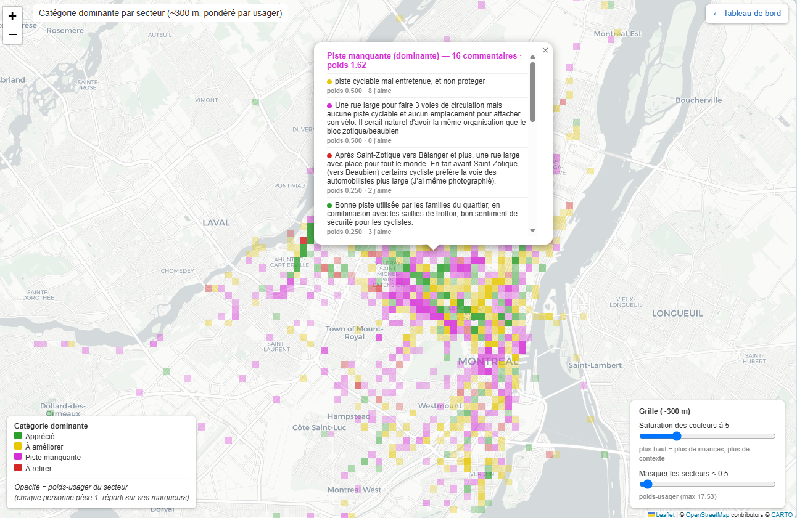

# Analyse de la consultation publique « La place du vélo à Montréal » (2026)

Analyse indépendante des marqueurs de carte déposés lors de la consultation publique en ligne de la
Ville de Montréal sur l'avenir du réseau cyclable de l'agglomération.

## Source des données

Les données proviennent de la consultation publique de la Ville de Montréal :

> **[Réalisons Montréal — « Partagez votre expérience : la place du vélo à Montréal »](https://realisons.montreal.ca/projects/place-du-velo)**

La Ville de Montréal invitait la population à participer à une consultation visant à **améliorer et
développer l'ensemble du réseau cyclable de l'agglomération**. La démarche recueillait l'avis des
participant·e·s sur :

- leur expérience du réseau cyclable actuel;
- leurs habitudes et besoins de déplacement;
- les enjeux de sécurité, de cohabitation et d'accessibilité;
- les priorités à envisager pour les prochaines années.

**Format :** consultation publique en ligne
**Période de consultation :** 25 juin 2026 – 25 juillet 2026
**Extrait analysé :** données au **10 juillet 2026** (extrait partiel — la consultation était toujours
ouverte au moment de la collecte).

Cette analyse porte uniquement sur la **question cartographique (id 11865)** du sondage : « Sur la
carte, indiquez les endroits, partout dans l'agglomération, où les infrastructures cyclables sont
appréciées, à améliorer, manquantes ou à retirer. » Soit **11 465 marqueurs**, répartis en quatre
catégories :

| Catégorie | Couleur |
|---|---|
| 🟢 Appréciée | vert |
| 🟡 À améliorer / ajuster | jaune |
| 🟣 Manquante | magenta |
| 🔴 À retirer | rouge |

## Visualisation phare — carte de la catégorie dominante

[](carte-dominante.html)

Chaque cellule (~300 m) prend la couleur de la catégorie qui y détient le plus de **poids-usager**
(chaque personne pèse 1, réparti sur ses marqueurs), ce qui **dé-biaise l'analyse des usagers très
prolifiques**. Un curseur règle la **saturation des couleurs** (pour garder le contexte cartographique)
et un autre masque les secteurs peu actifs. **Cliquez un secteur** pour lire ses commentaires, du plus
lourd au plus léger.

➡️ Carte interactive plein écran : [`carte-dominante.html`](carte-dominante.html) · tableau de bord
complet : [`index.html`](index.html).

## Confidentialité et anonymisation

- Le fichier source brut (`raw/`, p. ex. `raw/forms-2026-07-10.json`) contient des renseignements
  personnels (noms, courriels et réponses complètes au sondage). Il **n'est pas versionné** (voir
  [`.gitignore`](.gitignore)).
- Tous les artefacts publiés sont **anonymisés** : les usagers ne sont désignés que par un identifiant
  numérique `user_id`. Sans le fichier source, la correspondance `user_id → personne` n'est pas
  reconstituable à partir du dépôt.

## Structure du dépôt

```
analysis/      Chaîne de traitement principale
experiments/   Vues exploratoires (pondération par utilisateur, corridors, réseau…)
output/        Artefacts générés (cartes, graphiques, CSV, rapport)
index.html     Site web complet du projet (publiable, p. ex. GitHub Pages)
raw/           Données source brutes — NON versionnées (PII)
```

### Chaîne de traitement

```
python analysis/extract.py     # raw/forms-*.json (ou pretty.json) -> output/markers.csv
python analysis/analyze.py     # graphiques + output/findings.json
python analysis/build_map.py   # output/map.html (carte interactive)
python analysis/people.py      # classements par personne (anonymisés)
```

Les scripts exploratoires sont documentés dans [`experiments/README.md`](experiments/README.md).

## Avertissements sur les données

- L'extrait courant (`raw/forms-*.json`) est en **UTF-8, accents intacts**. Le chargeur commun
  (`analysis/dataload.py`) détecte l'encodage et normalise les types, si bien qu'il lit aussi l'ancien
  extrait `raw/pretty.json` (UTF-16).
- L'ancien extrait UTF-16 avait des **accents corrompus** en amont (transcodage avec perte). Une réparation
  cosmétique existait (`analysis/textrepair.py`); comme les données actuelles sont propres, elle est
  désormais neutre (fonction identité) et n'a jamais touché les comptes, j'aime, coordonnées ni catégories.

## Avis

Analyse indépendante. Ce dépôt n'est pas affilié à la Ville de Montréal ni à Réalisons Montréal.
