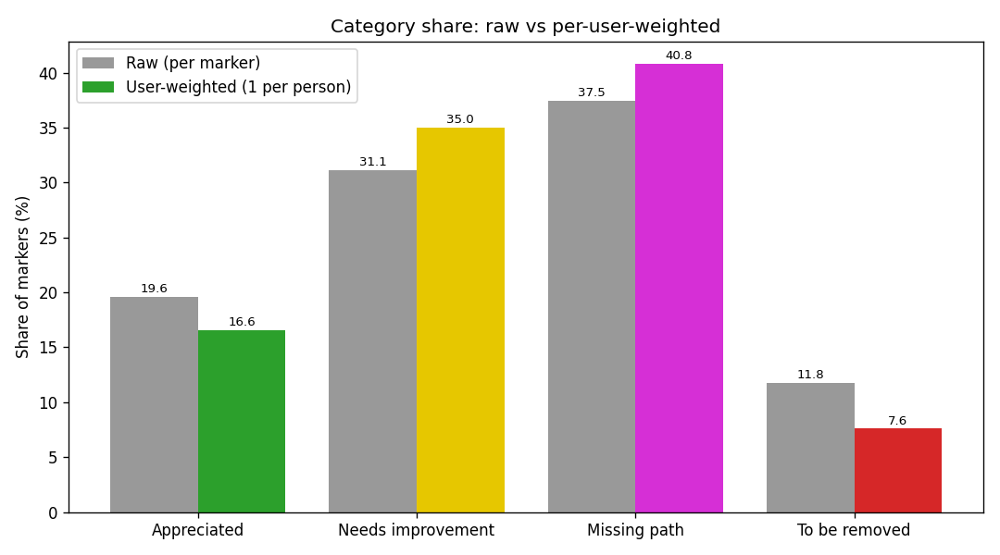

# Expérience : pondération par utilisateur

**Question :** les utilisateurs prolifiques déforment le portrait — un seul compte a placé
**116 des 392** marqueurs « À retirer ». Que se passe-t-il si l'on accorde une voix égale à chaque
participant?

**Méthode :** pondérer chaque marqueur par `1 / (nombre de marqueurs placés par l'utilisateur)`. Le
total des poids de chaque utilisateur vaut alors **1** (« une personne, un vote »). Une personne qui a
déposé 100 marqueurs contribue le même poids total que quelqu'un qui en a déposé un. Poids total =
**557** (utilisateurs uniques).

## Scripts
| Script | Sortie |
|---|---|
| `user_weighting.py` | `output/category_breakdown_weighted.png` + `.csv` — part des catégories, brute vs pondérée par utilisateur. Expose aussi `load_weighted()`. |
| `weighted_map.py` | `output/weighted_map.html` — couches de chaleur activables comparant la densité **BRUTE** vs **PONDÉRÉE PAR UTILISATEUR** vs pondérée par j'aime, plus 4 surfaces de demande pondérées par utilisateur, une par catégorie. |
| `blended_map.py` | `output/blended_map.html` — cartes **à vue unique fusionnée** (recommandé) : (1) **marqueurs pondérés, les plus lourds au-dessus** — cercles colorés par catégorie dont la taille/opacité ∝ au poids-utilisateur, dessinés pour que les plus grandes voix soient au-dessus; (2) **grille de catégorie dominante** (cellules ~300 m colorées selon la catégorie au plus grand poids-utilisateur, opacité ∝ au poids total). |
| `net_sentiment_map.py` | `output/net_sentiment_map.html` — choroplèthe divergente : **VERT = apprécié, ROUGE = à retirer** (pondéré par utilisateur; « à améliorer » et « voie manquante » exclus pour que le retrait soit le signal rouge sans ambiguïté). |
| `top_corridors.py` | `output/top_corridors.{png,csv}` — corridors montréalais nommés, classés par **personnes uniques** (une personne, un compte; participation = avoir **créé OU aimé** un marqueur). La barre est scindée par **position** : **Pour** (pro-infra seulement), **Mixte** (les deux), **Contre** (retrait seulement) — sans chevauchement → somme = `unique_participants`. Un usager qui aime 5 marqueurs d'un corridor compte une fois. Colonnes : `unique_participants`, `for_users`, `mixed_users`, `against_users`, `markers`, `total_likes` (référence non dédoublonnée), `cat1..4` (mix de catégories par marqueur). |
| `concentration.py` | `output/concentration_lorenz.png` — courbes de Lorenz + Gini pour les marqueurs / j'aime donnés / j'aime reçus par utilisateur. |
| `engagement_network.py` | `output/engagement_network.png` — réseau de co-appréciation des 140 personnes ayant donné le plus de j'aime; couleur = part de retrait, montre la masse pro-infra vs le groupe de retrait détaché. Nécessite `networkx`. |
| `build_dashboard.py` | **`output/dashboard.html`** — tableau de bord d'une page, épuré, moderne et animé, sur le gabarit d'administration **Tabler** (Bootstrap 5) + Chart.js, racontant l'histoire « minorité bruyante vs majorité pro-vélo » : cartes de statistiques animées, un beigne pro-vs-anti avec bascule **Par marqueurs ↔ Par personnes** (par personne : 90 % purement pro, 3 % mixtes, 7 % uniquement retrait), j'aime moyens par catégorie, une bascule « brut ↔ une personne, un vote » qui rétrécit la barre de retrait, un **curseur de concentration interactif** (« les N utilisateurs les plus actifs ont placé X % des marqueurs pro vs Y % des marqueurs de retrait ») et les contributeurs de retrait concentrés. Interface en **français canadien**. Nécessite Internet (CDN Tabler + Chart.js). |
| `build_site.py` | **`index.html`** (racine du dépôt) — **site web complet du projet**, en français, sur Tabler (mise en page avec barre latérale), regroupant *tous* les constats et visualisations : résumé exécutif + cartes de stats, catégories, engagement & priorités, pour-vs-contre (graphiques Chart.js interactifs), carte (aperçu statique + lien vers la carte interactive), corridors pour/mixte/contre, concentration (Lorenz), réseau d'engagement, thèmes textuels, classements de personnes (anonymisés) et méthodologie. Réutilise `compute()` de `build_dashboard.py` et lit `output/findings.json` + les CSV. Directement publiable (p. ex. GitHub Pages). Nécessite Internet (CDN Tabler + Chart.js). |

Exécution (depuis la racine du projet) :
```
pip install networkx                     # pour engagement_network.py
python experiments/user_weighting.py
python experiments/weighted_map.py
python experiments/blended_map.py
python experiments/net_sentiment_map.py
python experiments/top_corridors.py
python experiments/concentration.py
python experiments/engagement_network.py
python experiments/build_dashboard.py    # tableau de bord animé épuré
python experiments/build_site.py         # site web complet -> index.html (racine)
```
Tous réutilisent `output/markers.csv`, alors exécutez d'abord le `analysis/extract.py` principal
(`engagement_network.py` lit aussi `raw/pretty.json` pour les noms d'utilisateur).

## Constats retenus de ces vues
- **Concentration :** Gini **0,62** (marqueurs), **0,67** (j'aime donnés), **0,71** (j'aime reçus);
  les 10 % d'utilisateurs les plus actifs représentent ~51–60 % de toute l'activité — une forte
  concentration qui motive la pondération par utilisateur ci-dessus.
- **Principaux corridors (par personnes uniques, pour vs contre) :** **Saint-Denis** (173 personnes,
  168 pour / 4 contre), **Avenue du Parc** (156 : 144 / 9), **Saint-Laurent** (149 : 142 / 7),
  **De Maisonneuve** (146 : 141 / 3), **Rachel** (142 : 140 / 2). **Chaque corridor est massivement
  *pour*.** Fait marquant : **Henri-Bourassa** — le point chaud du retrait avec **108 marqueurs
  « À retirer »** et le plus de j'aime bruts (649) — ne compte que **19 personnes contre vs 100 pour**.
  Ces 108 marqueurs viennent donc d'une poignée d'usagers, pas d'une opposition large : la
  visualisation par personne dégonfle l'apparente contestation. Le mélange de catégories par rue reste
  dans le CSV (`cat1..4`).
- **Réseau d'engagement :** 140 nœuds se divisent en une grande masse pro-infrastructure (3 communautés
  interreliées, 0 % de j'aime de retrait) et **un petit groupe détaché de 8 utilisateurs avec 95 % de
  j'aime de retrait** — confirmation visuelle d'une opposition concentrée et distincte.

### Pour visualiser les cartes HTML
Double-cliquez simplement sur le fichier `.html` pour l'ouvrir dans votre navigateur. Si vous utilisez
l'extension Claude/Chrome (qui bloque `file://`), servez plutôt le dossier en HTTP local :
```
python -m http.server 8731 --directory experiments/output
# puis ouvrez http://127.0.0.1:8731/blended_map.html
```

> Note sur « les plus lourds au-dessus » : les cartes de chaleur se mélangent de façon additive et
> n'ont **aucun ordre de superposition (z-order)**, alors l'idée des plus lourds au-dessus est mise en
> œuvre avec des cercles discrets dans `blended_map.py`, et non une carte de chaleur. Comme les
> utilisateurs occasionnels (1 marqueur → poids 1) devancent les prolifiques, mettre les plus lourds
> au-dessus élève la base large au-dessus des super-utilisateurs — le dé-biaisement rendu visible.

## Résultat — la part des catégories se déplace quand les utilisateurs prolifiques sont dé-biaisés


| Catégorie | % brut | % pondéré par utilisateur | Écart |
|---|--:|--:|--:|
| 🟢 Apprécié | 19,6 | 16,6 | −3,0 |
| 🟡 À améliorer | 31,1 | 35,0 | +3,8 |
| 🟣 Voie manquante | 37,5 | 40,8 | +3,3 |
| 🔴 À retirer | 11,8 | **7,6** | **−4,2** |

**À retenir :** « À retirer » **chute de plus d'un tiers (11,8 % → 7,6 %)** dès que chaque personne
compte une seule fois — ce qui confirme que la catégorie est gonflée par quelques opposants très
actifs. Les catégories constructives (à améliorer, voie manquante) **augmentent**, c'est-à-dire que la
demande pour de meilleures/nouvelles infrastructures repose sur une base encore plus large que ne le
laissent croire les comptes bruts.

## Comment lire la carte
Ouvrez `output/weighted_map.html` et activez les couches dans le contrôle en haut à gauche (une à la
fois) :
- **Densité – BRUTE** vs **Densité – PONDÉRÉE PAR UTILISATEUR** — basculez entre les deux : les points
  chauds générés par une seule personne prolifique s'estompent sous la pondération par utilisateur,
  tandis que les zones signalées par *plusieurs personnes distinctes* restent chaudes.
- **Pondéré par utilisateur – <catégorie>** — surfaces de demande dé-biaisées par catégorie (p. ex. où
  la véritable demande de *voie manquante* se concentre chez de nombreux résidents).

Toutes les couches de chaleur partagent un rayon/flou identique, alors les différences reflètent la
pondération, pas le style.

## Extensions possibles
- **Voix tenant compte des j'aime :** poids = `j'aime / nombre de marqueurs de l'utilisateur`
  (popularité, toujours normalisée par personne).
- **Normalisation par catégorie :** répartir le poids à l'intérieur de chaque catégorie plutôt que
  globalement.
- **Points chauds par auteurs distincts :** classer les cellules de la grille selon le *nombre
  d'utilisateurs uniques*, et non le nombre de marqueurs.
