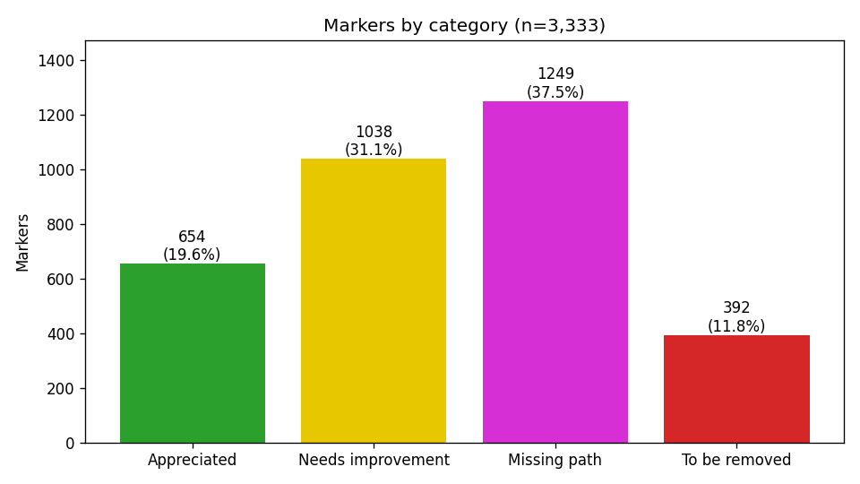
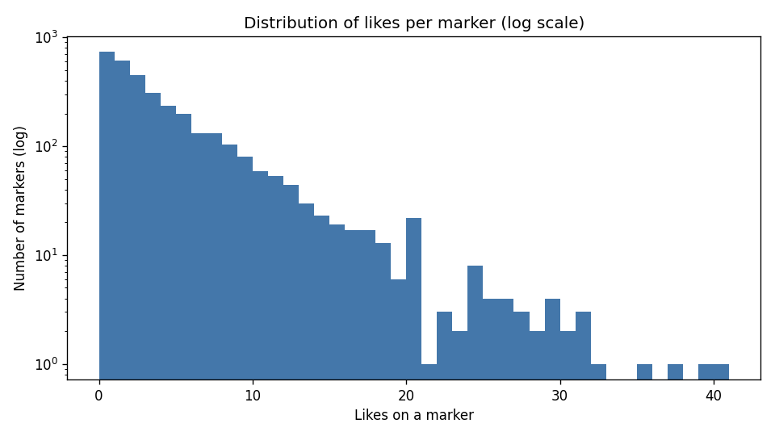
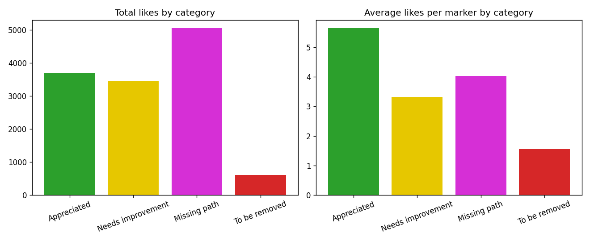
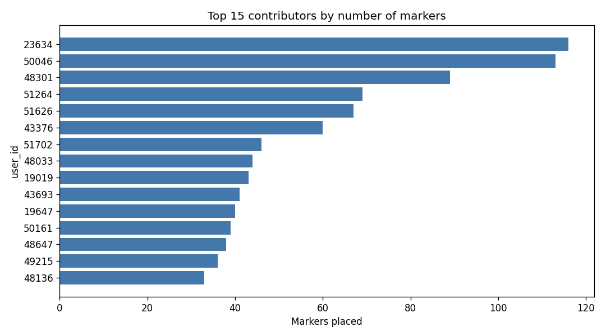
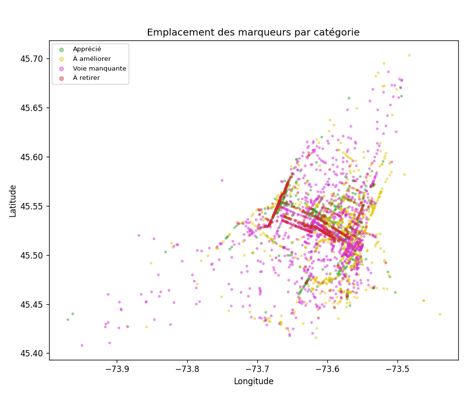
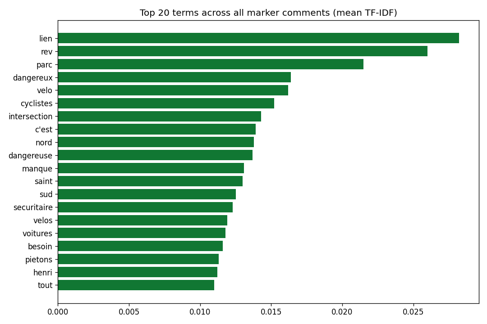

# Consultation sur le plan vélo — Analyse des marqueurs de carte

**Source :** `raw/pretty.json` → question **id 11865** (« Sur la carte, indiquez les endroits, partout
dans l'agglomération, où les infrastructures cyclables sont appréciées, à améliorer, manquantes ou à
retirer. ») · Consultation publique sur le plan vélo de la région de Montréal.
**Portée :** les 3 333 marqueurs de carte sous `mapMarkers` (les 8 autres questions du sondage sont hors portée).

## Comment lire ce rapport
- Graphiques : [`charts/`](charts) · Carte interactive : **[`map.html`](map.html)** (à ouvrir dans un navigateur)
- Données nettoyées : [`markers.csv`](markers.csv) (3 333 lignes) · Principaux marqueurs : [`top_markers.csv`](top_markers.csv)
- Classements de personnes : [`top_creators_by_category.csv`](top_creators_by_category.csv) (top 20 ×4) ·
  [`top_likers_by_category.csv`](top_likers_by_category.csv) (top 50 ×4)
- Chaîne de traitement : `analysis/extract.py` → `analysis/analyze.py` → `analysis/build_map.py` → `analysis/people.py`

## Méthodologie et note sur la qualité des données
- Le fichier est **encodé en UTF-16** (et non en UTF-8) et doit être lu avec `encoding='utf-16'`.
- **Les accents sont corrompus dans les données source** : avant que nous recevions le fichier, un
  transcodage avec perte a transformé chaque lettre accentuée en `??` et la plupart des apostrophes en
  `???`. **78 % des marqueurs (2 594 / 3 333) sont touchés** et les accents originaux sont
  *irrécupérables à partir des seules données.* Nous appliquons une réparation au mieux
  (`analysis/textrepair.py` : un dictionnaire de mots français courants + une règle qui convertit
  `??`→`e`, `???`→`'`) pour que le texte soit lisible. C'est **cosmétique seulement** — cela n'affecte
  jamais les comptes, les j'aime, les coordonnées ni les catégories. Le texte réparé peut comporter de
  légères imperfections orthographiques (p. ex. `e` là où il fallait `é/è/à`).
- **Anonymisation :** en vue d'une publication, **aucun nom n'est diffusé**. Les usagers sont désignés
  uniquement par leur identifiant numérique `user_id` (un pseudonyme), dans les classements comme dans
  les graphiques. Le fichier source `raw/pretty.json` — qui contient les vrais noms, courriels et
  réponses au sondage — n'est **pas** versionné (voir `.gitignore`); sans lui, la correspondance
  `user_id → personne` n'est pas reconstituable à partir du dépôt. Réserve résiduelle : le texte libre
  des marqueurs (`marker_text`) et les coordonnées exactes pourraient, à la marge, permettre une
  réidentification (quelqu'un qui se nomme dans un commentaire, un marqueur sur une adresse).
- Les thèmes textuels utilisent TF-IDF (uni+bigrammes, liste d'arrêt personnalisée FR+EN, accents
  retirés pour que les variantes se regroupent) et KMeans (k=6). Les points chauds géographiques
  utilisent un quadrillage en cellules de ~300 m (DBSCAN a été rejeté — son enchaînement de densité
  fusionnait tout le centre-ville en un seul amas).

---

## 1. Répartition par catégorie


| Catégorie | Marqueurs | Part |
|---|--:|--:|
| 🟣 Voie manquante | 1 249 | 37,5 % |
| 🟡 À améliorer | 1 038 | 31,1 % |
| 🟢 Apprécié | 654 | 19,6 % |
| 🔴 À retirer | 392 | 11,8 % |

**À retenir :** Près de **7 marqueurs sur 10 (68,6 %) signalent une lacune ou un problème** — liens
manquants plus voies à améliorer. À peine ~1 sur 5 célèbre les infrastructures existantes, et les
demandes de retrait forment le plus petit groupe. La consultation penche fortement vers une *demande de
plus et de meilleures* infrastructures cyclables.

## 2. Engagement et priorités de la communauté



- **12 791 j'aime au total** sur les marqueurs · moyenne **3,84** · max **40** · **2 596 (78 %)** marqueurs ont reçu ≥1 j'aime.
- **Les j'aime amplifient le signal « voie manquante » :** les marqueurs de voie manquante ont attiré le
  plus de j'aime au total (**5 042**). Les marqueurs appréciés ont la **moyenne la plus élevée** de
  j'aime (**5,65/marqueur**) — les gens se rallient autour des liens bien-aimés. Les marqueurs « À
  retirer » sont à la fois les moins nombreux *et* les moins aimés (608 au total, **moyenne 1,55**),
  c'est-à-dire que le sentiment de retrait a l'appui communautaire le plus faible.

**Principales priorités de la communauté** (marqueurs les plus aimés — liste complète dans
[`top_markers.csv`](top_markers.csv)) :

| J'aime | Catégorie | Commentaire (réparé) |
|--:|---|---|
| 40 | Voie manquante | Dangereux entre la rue du Quai de l'horloge et Saint-Laurent. Nous sommes jetes directement vers les piétons et touristes. |
| 39 | Voie manquante | Axe dangereux |
| 37 | Voie manquante | L'avenue du Parc est très dangereuse pour les cyclistes et les piétons… il faut un lien cyclable protégé. |
| 35 | Voie manquante | Area needs a dedicated bike path to connect |
| 32 | Voie manquante | Desperate need for a dedicated cycle path in this highly used corridor. |
| 31 | Apprécié | La piste cyclable en site propre est nettement mieux… il faut absolument compléter le projet. |
| 31 | À améliorer | Tellement de vélos sur la piste sur Rachel, il faudrait 2 pistes unidirectionnelles. |

Les commentaires les plus aimés sont dominés par la **sécurité sur les liens manquants** (notamment
*l'avenue du Parc* et le secteur du *Vieux-Port / Quai de l'Horloge*).

## 3. Contributeurs


- **557 auteurs uniques**; médiane de **2 marqueurs** par auteur. La participation est large mais avec un
  noyau actif en longue traîne — l'auteur le plus prolifique a placé à lui seul 116 marqueurs (**3,5 %**
  de tous les marqueurs).

**Utilisateur le plus actif par catégorie :**

| Catégorie | user_id | Marqueurs | J'aime obtenus |
|---|--:|--:|--:|
| 🟢 Apprécié | 50161 | 30 | 34 |
| 🟡 À améliorer | 48301 | 48 | 140 |
| 🟣 Voie manquante | 50046 | 97 | 362 |
| 🔴 À retirer | 23634 | 116 | 138 |

**Note :** le contributeur le plus prolifique au total est l'utilisateur **23634**, dont les **116
marqueurs sont *tous* « À retirer »** — ce seul compte représente **29,6 % de toute la catégorie de
retrait**. Le sentiment de retrait est donc loin d'être largement partagé (voir §4). À l'inverse,
l'utilisateur **43376** a obtenu le plus de j'aime (673) à partir de seulement 60 marqueurs — un signal
élevé par marqueur.

## 4. Points chauds géographiques


Les marqueurs ont été regroupés en cellules d'un quadrillage de ~300 m; **176 cellules contiennent ≥5
marqueurs (1 580 marqueurs au total)**. Principaux points chauds par total de j'aime (représentatif = le
commentaire voisin le plus aimé) :

| Marqueurs | J'aime | Catégorie dominante | ~Emplacement (lat, lon) | Commentaire représentatif |
|--:|--:|---|---|---|
| 24 | 263 | Voie manquante | 45,5074, −73,5518 | Dangereux entre Quai de l'Horloge et Saint-Laurent (Vieux-Port) |
| 34 | 214 | À retirer | 45,5531, −73,6693 | (corridor du REV contesté — voir §5) |
| 17 | 173 | Voie manquante | 45,5096, −73,5507 | Area needs a dedicated bike path to connect |
| 21 | 144 | À améliorer | 45,5097, −73,5667 | One of the most dangerous intersections for cyclists |
| 27 | 139 | Voie manquante | 45,5230, −73,6039 | Piste cyclable manquante sur l'avenue du Parc |
| 14 | 109 | Voie manquante | 45,5184, −73,5929 | Avenue du Parc — très dangereuse, besoin d'un lien protégé |

**À retenir :**
- **Deux pôles de demande dominent :** le **Vieux-Port / centre-ville est** (Quai de l'Horloge ↔
  Saint-Laurent) et **l'avenue du Parc** — tous deux signalés à répétition comme *manquants* et
  *dangereux*.
- **Les points chauds de retrait ≠ des lieux contestés — ce sont une opposition concentrée avec laquelle
  le public est en désaccord.** Dans les 7 cellules à dominante de retrait, les marqueurs de retrait
  n'ont obtenu que **183 j'aime** tandis que les marqueurs *Apprécié* dans ces **mêmes cellules** en ont
  obtenu **395 (2,2×)**. Combiné au fait que l'utilisateur 23634 fournit ~30 % de tous les marqueurs de
  retrait (§3), le portrait est celui de **quelques opposants bruyants sur des voies que le grand public
  apprécie**, et non d'une véritable contestation 50/50.

## 5. Thèmes textuels


Termes les plus fréquents au total : **lien, REV, parc, dangereux, vélo, cyclistes, intersection,
manque, sécuritaire, piétons**. Vocabulaire transversal : *sécurité* (« dangereux/dangereuse »,
« sécuritaire »), *connectivité* (« lien », « manque », « nord/sud ») et le **REV** (Réseau Express Vélo).

**Termes distinctifs par catégorie :**
- **🟢 Apprécié :** apprécié, pratique, sécuritaire, belle, agréable, merci, REV — éloges des liens sûrs et utiles.
- **🟡 À améliorer :** intersection, voitures, dangereuse, bande (cyclable), sécuriser — friction aux intersections et conflit auto/vélo.
- **🟣 Voie manquante :** REV, lien, parc, manque, nord/sud, Sherbrooke — demande de nouvelles connexions, surtout l'avenue du Parc et les axes N-S.
- **🔴 À retirer :** **Henri-Bourassa**, inutile, traffic, **feux rouges**, réseau artériel — opposition concentrée à des segments artériels précis du REV.

**Thèmes KMeans (k=6) :** *(note : k=6 a laissé un méga-amas de 81 % de commentaires génériques sur la
sécurité; seuls les thèmes plus petits et distinctifs 2 à 6 se sont séparés nettement.)*

| Taille | Thème | Principaux termes | Exemple |
|--:|---|---|---|
| 2 705 | Sécurité / danger en général | lien, parc, dangereux, vélo, cyclistes, intersection | « Axe dangereux » |
| 265 | Éloge/extension du réseau REV | REV, Saint, Jarry, Sherbrooke, Saint-Urbain | « Depuis que le REV est présent sur Saint-Denis, la vitalité commerciale explose. » |
| 144 | Lacunes de connectivité nord-sud | nord, sud, nord-sud, lien, manque | « Le REV St-Denis est un game-changer en Nord-Sud » |
| 111 | Demandes en anglais | bike, path, lane, street, needs | « Parc needs protected bike paths. We've seen too many deaths and injuries here. » |
| 69 | Opposition Henri-Bourassa | Henri, traffic, feux rouges, inutile | « Inutile sur tout Henri-Bourassa! C'est dans le traffic et on arrête à tous les 100 m pour des feux rouges. » |
| 39 | « Nuit au réseau artériel » | artérielle, réseau, nuit | « Nuit au réseau artériel et détourne la circulation sur les rues locales. » |

**À retenir :** Le récit dominant est la **sécurité + la connectivité** (thèmes 1–3, ~95 % des
marqueurs). Le sentiment de retrait est **étroit et concentré** (thèmes 4–5, ~3 % des marqueurs) —
massivement à propos de segments artériels précis du REV (Henri-Bourassa), faisant écho aux points
chauds contestés du §4. Une **minorité anglophone** notable (thème 4) exprime les mêmes demandes de
sécurité et de liens manquants.

---

## 6. Classements de personnes par catégorie
Listes complètes : [`top_creators_by_category.csv`](top_creators_by_category.csv) (top **20** créateurs
×4 catégories) et [`top_likers_by_category.csv`](top_likers_by_category.csv) (top **50** personnes ×4).
Un j'aime est crédité à la catégorie du marqueur sur lequel il a été placé. Le top 10 est montré ici.

### Principaux créateurs (marqueurs placés), par catégorie
| # | 🟢 Apprécié | 🟡 À améliorer | 🟣 Voie manquante | 🔴 À retirer |
|--:|---|---|---|---|
| 1 | user 50161 — 30 | user 48301 — 48 | user 50046 — 97 | user 23634 — 116 |
| 2 | user 43376 — 28 | user 48647 — 26 | user 48301 — 37 | user 51264 — 69 |
| 3 | user 48033 — 19 | user 48333 — 19 | user 19647 — 30 | user 51626 — 66 |
| 4 | user 51315 — 19 | user 49215 — 19 | user 19019 — 27 | user 49604 — 19 |
| 5 | user 49846 — 16 | user 47608 — 16 | user 51702 — 27 | user 51588 — 12 |
| 6 | user 18293 — 13 | user 48137 — 16 | user 48136 — 22 | user 51603 — 11 |
| 7 | user 50569 — 12 | user 19019 — 15 | user 43693 — 20 | user 24489 — 10 |
| 8 | user 19009 — 11 | user 43376 — 14 | user 43376 — 18 | user 48993 — 10 |
| 9 | user 23610 — 11 | user 48739 — 14 | user 48251 — 16 | user 49770 — 10 |
| 10 | user 43693 — 11 | user 18415 — 13 | user 51577 — 16 | user 23994 — 7 |

### Principaux donneurs de j'aime (j'aime donnés), par catégorie
| # | 🟢 Apprécié | 🟡 À améliorer | 🟣 Voie manquante | 🔴 À retirer |
|--:|---|---|---|---|
| 1 | user 19019 — 146 | user 19019 — 225 | user 19019 — 427 | user 24489 — 202 |
| 2 | user 50569 — 144 | user 48301 — 174 | user 48301 — 192 | user 51675 — 75 |
| 3 | user 18309 — 108 | user 51398 — 70 | user 18475 — 172 | user 23634 — 74 |
| 4 | user 19009 — 93 | user 51083 — 68 | user 50569 — 134 | user 51308 — 37 |
| 5 | user 51506 — 89 | user 48140 — 62 | user 51512 — 119 | user 50161 — 37 |
| 6 | user 51512 — 88 | user 51375 — 62 | user 18309 — 110 | user 51493 — 29 |
| 7 | user 51631 — 63 | user 51656 — 54 | user 51398 — 102 | user 51588 — 27 |
| 8 | user 49044 — 62 | user 48647 — 49 | user 51083 — 95 | user 23962 — 26 |
| 9 | user 23025 — 58 | user 49394 — 48 | user 48140 — 79 | user 51603 — 13 |
| 10 | user 51083 — 58 | user 49600 — 47 | user 23025 — 78 | user 23994 — 12 |

**À retenir :**
- **Un partisan ultra-engagé domine le camp pro-vélo :** l'usager **user 19019** est le donneur de j'aime
  nº 1 dans les trois catégories positives/constructives — **427** j'aime sur les seuls marqueurs de voie
  manquante, plus 225 et 146 — et a aussi créé 27 marqueurs de voie manquante. Une poignée d'identifiants
  (user 19019, user 48301, user 50569, user 51083) reviennent à travers les catégories constructives.
- **Le camp du retrait est un petit groupe distinct :** la création est menée par **user 23634** (116, tous
  de retrait) et **user 51264** (69); les j'aime par **user 24489** (202) et **user 51675** (75). Ces
  identifiants ne recoupent presque pas la foule pro-infrastructure — une cohorte distincte et concentrée
  plutôt que la base large.

## Conclusions
1. **La demande l'emporte largement sur la satisfaction :** 68,6 % des marqueurs signalent des lacunes ou des problèmes; seuls 19,6 % sont des éloges.
2. **La sécurité stimule l'engagement :** les marqueurs les plus aimés portent sur des *liens manquants dangereux*, concentrés sur **l'avenue du Parc** et le corridor du **Vieux-Port / centre-ville est**.
3. **Le retrait est une position minoritaire, portée par un seul auteur :** seulement 11,8 % des marqueurs, le moins de j'aime par marqueur, et **~30 % de toute la catégorie provient d'un seul compte (user 23634, 116/392, tous de retrait)**.
4. **Sur les corridors d'apparence contestée, le public prend le parti de la voie, pas du retrait :** dans les points chauds à dominante de retrait, les marqueurs Apprécié devancent les marqueurs de retrait en j'aime **2,2×** (395 contre 183). Le REV est largement salué (connectivité, voire vitalité commerciale); l'opposition est **étroite et concentrée**, axée sur des segments artériels précis (Henri-Bourassa).
5. **Participation large :** 557 contributeurs, surtout légers (médiane de 2 marqueurs), avec un noyau actif et une minorité anglophone notable.

## Reproduire
```
pip install pandas folium scikit-learn        # matplotlib/numpy/scipy déjà présents
python analysis/extract.py                     # -> output/markers.csv (3 333 lignes)
python analysis/analyze.py                      # -> charts/, findings.json, top_markers.csv
python analysis/build_map.py                    # -> output/map.html
python analysis/people.py                       # -> top_creators_by_category.csv, top_likers_by_category.csv
```
