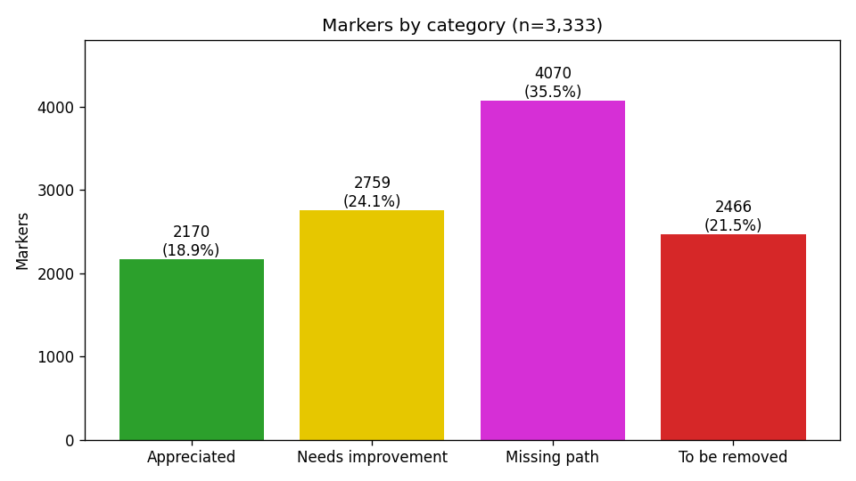
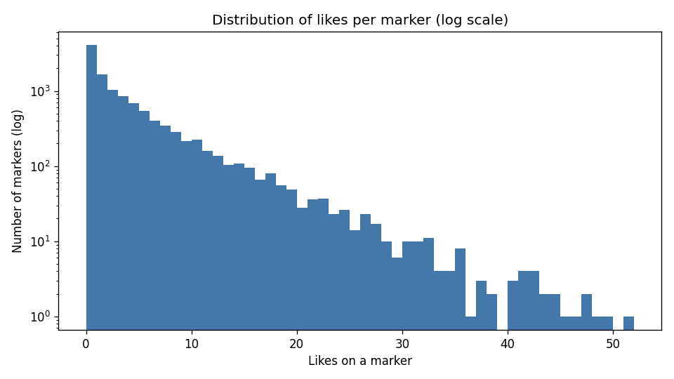
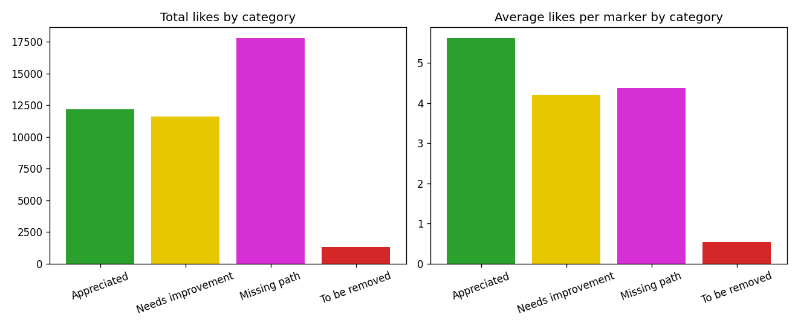
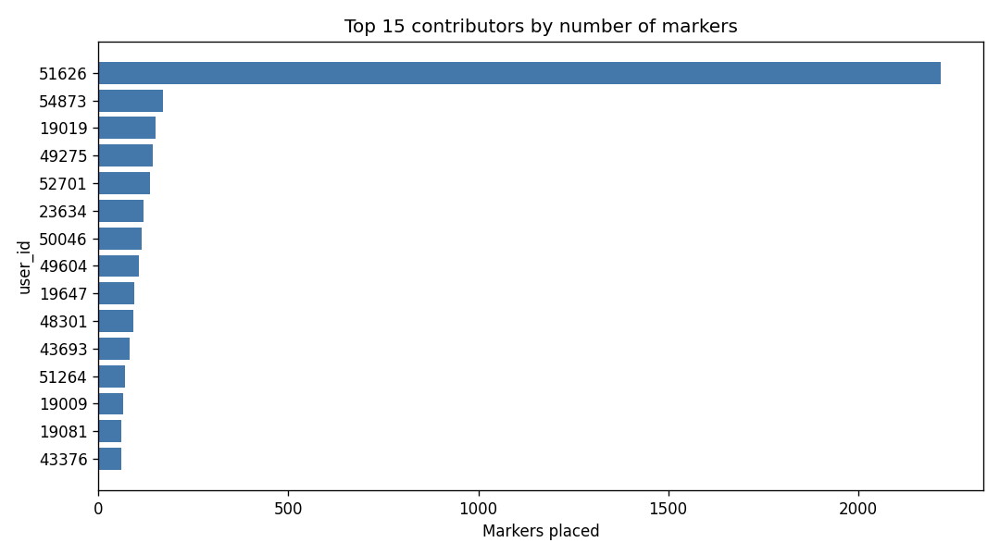
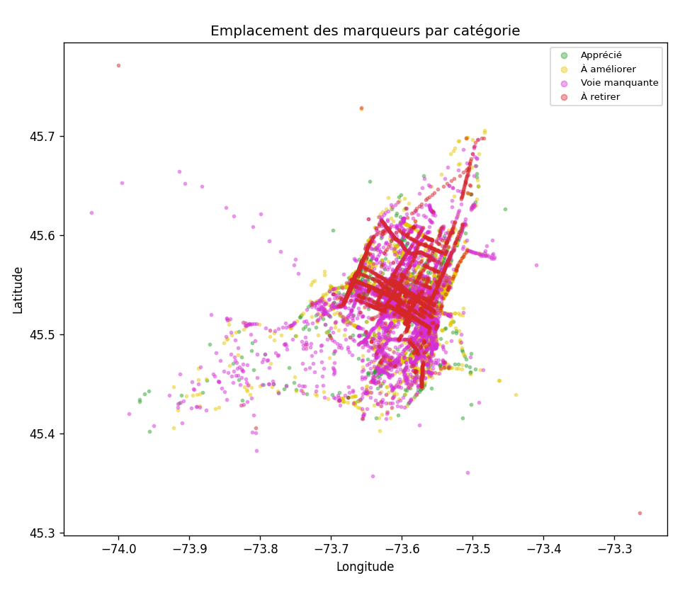
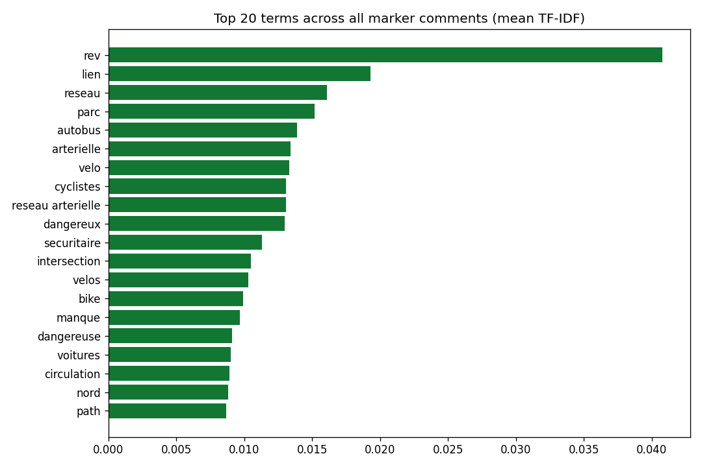

# Consultation sur le plan vélo — Analyse des marqueurs de carte

**Source :** `raw/forms-2026-07-10.json` → question **id 11865** (« Sur la carte, indiquez les endroits, partout
dans l'agglomération, où les infrastructures cyclables sont appréciées, à améliorer, manquantes ou à
retirer. ») · Consultation publique sur le plan vélo de la région de Montréal.
**Extrait analysé :** données au **10 juillet 2026** (la consultation, ouverte du 25 juin au 25 juillet 2026,
était toujours en cours au moment de la collecte).
**Portée :** les 11 465 marqueurs de carte sous `mapMarkers` (les 8 autres questions du sondage sont hors portée).

## Comment lire ce rapport
- Graphiques : [`charts/`](charts) · Carte interactive : **[`map.html`](map.html)** (à ouvrir dans un navigateur)
- Données nettoyées : [`markers.csv`](markers.csv) (11 465 lignes) · Principaux marqueurs : [`top_markers.csv`](top_markers.csv)
- Classements de personnes : [`top_creators_by_category.csv`](top_creators_by_category.csv) (top 20 ×4) ·
  [`top_likers_by_category.csv`](top_likers_by_category.csv) (top 50 ×4)
- Chaîne de traitement : `analysis/extract.py` → `analysis/analyze.py` → `analysis/build_map.py` → `analysis/people.py`

## Méthodologie et note sur la qualité des données
- **Format source :** l'extrait courant (`raw/forms-*.json`) est en **UTF-8 avec accents intacts**. Le chargeur
  commun (`analysis/dataload.py`) lit aussi l'ancien extrait `raw/pretty.json` (UTF-16, dont les accents avaient
  été détruits par un transcodage avec perte en amont) : il détecte l'encodage et normalise les types. La
  réparation d'accents historique (`analysis/textrepair.py`) n'est donc plus nécessaire sur les données actuelles.
- **Anonymisation :** en vue d'une publication, **aucun nom n'est diffusé**. Les usagers sont désignés
  uniquement par leur identifiant numérique `user_id` (un pseudonyme), dans les classements comme dans
  les graphiques. Le fichier source — qui contient les vrais noms, courriels et réponses au sondage — n'est
  **pas** versionné (voir `.gitignore`); sans lui, la correspondance `user_id → personne` n'est pas
  reconstituable à partir du dépôt. Réserve résiduelle : le texte libre des marqueurs (`marker_text`) et les
  coordonnées exactes pourraient, à la marge, permettre une réidentification (quelqu'un qui se nomme dans un
  commentaire, un marqueur sur une adresse).
- Les thèmes textuels utilisent TF-IDF (uni+bigrammes, liste d'arrêt personnalisée FR+EN, accents
  retirés pour que les variantes se regroupent) et KMeans (k=6). Les points chauds géographiques
  utilisent un quadrillage en cellules de ~300 m (DBSCAN a été rejeté — son enchaînement de densité
  fusionnait tout le centre-ville en un seul amas).

---

## 1. Répartition par catégorie


| Catégorie | Marqueurs | Part |
|---|--:|--:|
| 🟣 Voie manquante | 4 070 | 35,5 % |
| 🟡 À améliorer | 2 759 | 24,1 % |
| 🔴 À retirer | 2 466 | 21,5 % |
| 🟢 Apprécié | 2 170 | 18,9 % |

**À retenir :** Près de **6 marqueurs sur 10 (59,6 %) signalent une lacune ou un problème** — liens
manquants plus voies à améliorer — contre à peine ~1 sur 5 qui célèbre les infrastructures existantes.
La catégorie « À retirer » paraît importante (21,5 %), mais elle est **fortement gonflée par un seul
usager** : à lui seul, l'usager **51626** a déposé **1 784 des 2 466 marqueurs de retrait (72,3 %)** (voir
§3). Une fois **pondéré par usager** (chaque personne pèse 1, ses marqueurs se partageant ce poids), le
retrait retombe à **7,4 %** et la voie manquante monte à 39,0 % — la consultation penche nettement vers
une *demande de plus et de meilleures* infrastructures cyclables.

## 2. Engagement et priorités de la communauté



- **42 866 j'aime au total** sur les marqueurs · moyenne **3,74** · max **51** · **7 383 (64,4 %)** marqueurs ont reçu ≥1 j'aime.
- **Les j'aime amplifient le signal « voie manquante » :** les marqueurs de voie manquante ont attiré le
  plus de j'aime au total (**17 767**). Les marqueurs appréciés ont la **moyenne la plus élevée** de
  j'aime (**5,61/marqueur**) — les gens se rallient autour des liens bien-aimés. Les marqueurs « À
  retirer » sont à la fois nombreux (à cause d'un seul usager) *et* les moins aimés : **1 335 j'aime au
  total, moyenne 0,54/marqueur** — soit **l'appui communautaire le plus faible et de loin**. Seulement
  **3,1 %** de tous les j'aime portent sur des marqueurs de retrait; **96,9 %** vont aux catégories
  constructives.

**Principales priorités de la communauté** (marqueurs les plus aimés — liste complète dans
[`top_markers.csv`](top_markers.csv)) :

| J'aime | Catégorie | Commentaire |
|--:|---|---|
| 51 | Voie manquante | Dangereux entre la rue du Quai de l'horloge et Saint-Laurent. Nous sommes jetés directement vers les piétons et touristes. |
| 49 | Apprécié | Lien cyclable essentiel pour la sécurité des mouvements est-ouest dans l'axe. |
| 48 | Voie manquante | Manque de continuité de la piste. |
| 47 | Voie manquante | Desperate need for a dedicated cycle path in this highly used corridor. |
| 46 | Apprécié | Permet de sécuriser l'accès à une école. |
| 45 | Voie manquante | Piste manquante entre Saint-Gabriel et le Quai de l'Horloge. |

Les commentaires les plus aimés sont dominés par la **sécurité sur les liens manquants** (notamment
le secteur du *Vieux-Port / Quai de l'Horloge* et *l'avenue du Parc*).

## 3. Contributeurs


- **1 840 auteurs uniques**; médiane de **2 marqueurs** par auteur. La participation est large, mais avec une
  **queue longue extrême** : l'auteur le plus prolifique, l'usager **51626**, a placé à lui seul **2 219
  marqueurs — 19,4 % de *tous* les marqueurs** de la consultation.
- **Un seul compte façonne la catégorie « À retirer » :** sur ses 2 219 marqueurs, **1 784 sont « À
  retirer » (72,3 % de la catégorie)**, le reste se répartissant surtout en voie manquante (341) et à
  améliorer (92). Ses marqueurs de retrait sont des **slogans répétés** disséminés sur la carte — p. ex.
  « Pas de sabotage du réseau artérielle » (×102), « Autobus ralenti par les vélos sur voie réservée aux
  autobus » (×94), « Manque de stationnement » (×43) : une **campagne individuelle** anti-REV / pro-voiture
  plutôt qu'un signal communautaire (voir §5).

**Utilisateur le plus actif par catégorie :**

| Catégorie | user_id | Marqueurs | J'aime obtenus |
|---|--:|--:|--:|
| 🟢 Apprécié | 19009 | 44 | 319 |
| 🟡 À améliorer | 51626 | 92 | 46 |
| 🟣 Voie manquante | 51626 | 341 | 114 |
| 🔴 À retirer | 51626 | 1 784 | 265 |

**Note :** l'usager **51626** est le contributeur le plus prolifique dans trois des quatre catégories. Ses
1 784 marqueurs de retrait n'ont récolté que **265 j'aime au total** (0,15/marqueur) — un volume énorme
pour un appui quasi nul. À l'inverse, l'usager **19019** a obtenu **691 j'aime** à partir de 149 marqueurs —
un signal élevé par marqueur, tourné vers les catégories constructives.

## 4. Points chauds géographiques


Les marqueurs ont été regroupés en cellules d'un quadrillage de ~300 m; **652 cellules contiennent ≥5
marqueurs (8 611 marqueurs au total)**. Principaux points chauds par total de j'aime (représentatif = le
commentaire voisin le plus aimé) :

| Marqueurs | J'aime | Catégorie dominante | ~Emplacement (lat, lon) | Commentaire représentatif |
|--:|--:|---|---|---|
| 55 | 660 | Voie manquante | 45,5075, −73,5518 | Dangereux entre Quai de l'Horloge et Saint-Laurent (Vieux-Port) |
| 71 | 543 | Apprécié | 45,5531, −73,6693 | Une superbe piste qui permet de traverser rapidement le quartier |
| 49 | 496 | Voie manquante | 45,5094, −73,5508 | Area needs a dedicated bike path to connect |
| 54 | 397 | Apprécié | 45,5476, −73,6726 | Besoin de plus de liens comme celui-ci ! |
| 74 | 370 | Voie manquante | 45,5231, −73,6043 | Piste cyclable manquante sur l'avenue du Parc — incroyablement dangereux |
| 56 | 330 | Voie manquante | 45,5182, −73,5927 | L'avenue du Parc est très dangereuse pour les cyclistes et les piétons |

**À retenir :**
- **Deux pôles de demande dominent :** le **Vieux-Port / centre-ville est** (Quai de l'Horloge ↔
  Saint-Laurent) et **l'avenue du Parc** — tous deux signalés à répétition comme *manquants* et
  *dangereux*. Les points chauds les plus aimés à dominante *Apprécié* correspondent à des tronçons de REV
  salués (Rosemont / La Petite-Patrie).
- **Là où le retrait domine, le public prend le parti de la voie.** Dans les **69 cellules à dominante de
  retrait**, les marqueurs de retrait n'ont obtenu que **233 j'aime** tandis que les marqueurs *Apprécié*
  dans ces **mêmes cellules** en ont obtenu **1 384 (5,9×)**. Combiné au fait qu'un seul usager fournit
  72,3 % des marqueurs de retrait (§3), le portrait est celui d'**une opposition individuelle bruyante sur
  des voies que le grand public apprécie**, et non d'une contestation partagée.

## 5. Thèmes textuels


Termes les plus fréquents au total : **REV, lien, réseau, parc, autobus, artérielle, vélo, cyclistes,
dangereux, sécuritaire, intersection, manque**. Vocabulaire transversal : *sécurité* (« dangereux/
dangereuse », « sécuritaire »), *connectivité* (« lien », « manque », « nord/sud ») et le **REV** (Réseau
Express Vélo), à la fois plébiscité et cible de l'opposition.

**Termes distinctifs par catégorie :**
- **🟢 Apprécié :** REV, lien, apprécié, super, sécuritaire, belle, pratique, utile — éloges des liens sûrs et utiles.
- **🟡 À améliorer :** intersection, cyclistes, voitures, dangereux, piétons, automobilistes, bande (cyclable), sécuriser — friction aux intersections et conflit auto/vélo.
- **🟣 Voie manquante :** REV, lien, dangereux, parc, manque, nord/sud, Sherbrooke — demande de nouvelles connexions, surtout l'avenue du Parc et les axes N-S.
- **🔴 À retirer :** **réseau artérielle**, **autobus**, congestion, réservée (autobus), **sabotage**, parc — vocabulaire d'une campagne anti-REV / pro-voiture concentrée (voir §3, usager 51626).

**Thèmes KMeans (k=6) :** *(note : k=6 a laissé un méga-amas de ~76 % de commentaires génériques sur la
sécurité; les thèmes plus petits et distinctifs 2 à 6 se sont séparés nettement.)*

| Taille | Thème | Principaux termes | Exemple |
|--:|---|---|---|
| 8 710 | Sécurité / danger en général | autobus, REV, vélo, dangereux, cyclistes, intersection | « Axe dangereux » |
| 1 739 | Lacunes de connectivité nord-sud | lien, parc, nord, sud, nord-sud, manquant | « Lien cyclable essentiel pour les mouvements est-ouest » |
| 393 | Opposition « réseau artériel » | artérielle, sabotage réseau, congestion, REV | « Nuit au réseau artérielle » |
| 271 | Demande / promesse de REV | REV, essentiel, promis, l'est, urbain | « Un REV nous a été promis ici. » |
| 236 | REV Jean-Talon | Jean-Talon, sens uniques, REV | « Continuer le REV Jean-Talon entre Boyer et Acadie ! » |
| 116 | Sécurité aux écoles / séparation physique | élèves, cyclistes, séparation, automobilistes | « Séparation physique entre les voitures et les cyclistes, de chaque côté » |

**À retenir :** Le récit dominant est la **sécurité + la connectivité** (thèmes 1, 2, 4, 5 — l'essentiel des
marqueurs). Le sentiment de retrait forme un **thème étroit** (thème 3, ~3 % des marqueurs) — massivement à
propos du « réseau artériel », des voies réservées aux autobus et du REV, et **porté par un seul compte**
(§3), faisant écho aux points chauds contestés du §4.

---

## 6. Classements de personnes par catégorie
Listes complètes : [`top_creators_by_category.csv`](top_creators_by_category.csv) (top **20** créateurs
×4 catégories) et [`top_likers_by_category.csv`](top_likers_by_category.csv) (top **50** personnes ×4).
Un j'aime est crédité à la catégorie du marqueur sur lequel il a été placé. Le top 10 est montré ici.

### Principaux créateurs (marqueurs placés), par catégorie
| # | 🟢 Apprécié | 🟡 À améliorer | 🟣 Voie manquante | 🔴 À retirer |
|--:|---|---|---|---|
| 1 | user 19009 — 44 | user 51626 — 92 | user 51626 — 341 | user 51626 — 1 784 |
| 2 | user 55207 — 37 | user 48301 — 50 | user 54873 — 170 | user 23634 — 119 |
| 3 | user 50161 — 30 | user 19019 — 43 | user 52701 — 122 | user 49604 — 104 |
| 4 | user 24078 — 29 | user 51572 — 30 | user 49275 — 116 | user 51264 — 69 |
| 5 | user 43376 — 28 | user 48647 — 26 | user 50046 — 97 | user 23785 — 16 |
| 6 | user 49275 — 23 | user 19647 — 25 | user 19019 — 81 | user 51603 — 13 |
| 7 | user 52509 — 22 | user 52528 — 24 | user 19647 — 60 | user 51588 — 12 |
| 8 | user 48033 — 19 | user 19081 — 21 | user 43693 — 50 | user 24489 — 11 |
| 9 | user 51315 — 19 | user 24078 — 19 | user 50821 — 39 | user 49770 — 11 |
| 10 | user 19019 — 17 | user 48333 — 19 | user 48301 — 37 | user 48993 — 10 |

### Principaux donneurs de j'aime (j'aime donnés), par catégorie
| # | 🟢 Apprécié | 🟡 À améliorer | 🟣 Voie manquante | 🔴 À retirer |
|--:|---|---|---|---|
| 1 | user 51050 — 1 234 | user 51050 — 1 632 | user 51050 — 2 102 | user 24489 — 326 |
| 2 | user 19019 — 283 | user 19019 — 499 | user 19019 — 777 | user 51675 — 75 |
| 3 | user 19009 — 197 | user 48301 — 243 | user 48301 — 253 | user 23634 — 74 |
| 4 | user 18309 — 181 | user 23051 — 158 | user 18309 — 214 | user 51626 — 56 |
| 5 | user 46286 — 162 | user 48198 — 104 | user 18475 — 172 | user 51603 — 48 |
| 6 | user 23696 — 149 | user 48655 — 101 | user 52598 — 158 | user 23105 — 42 |
| 7 | user 50569 — 144 | user 55087 — 95 | user 52480 — 143 | user 51308 — 37 |
| 8 | user 54705 — 142 | user 22853 — 80 | user 50569 — 134 | user 50161 — 37 |
| 9 | user 17704 — 137 | user 45151 — 77 | user 52112 — 131 | user 53671 — 30 |
| 10 | user 53724 — 130 | user 51398 — 70 | user 54178 — 127 | user 23994 — 29 |

**À retenir :**
- **Un partisan ultra-engagé domine l'appui pro-vélo :** l'usager **51050** est le donneur de j'aime nº 1
  dans les trois catégories constructives — **2 102** j'aime sur les seuls marqueurs de voie manquante,
  plus 1 632 et 1 234, soit près de **5 000 j'aime** presque tous positifs. L'usager **19019** revient en
  nº 2 partout (283 + 499 + 777).
- **Le camp du retrait est un petit groupe distinct :** la création est écrasée par **user 51626** (1 784);
  les j'aime par **user 24489** (326) et **user 51675** (75). Ces identifiants ne recoupent presque pas la
  foule pro-infrastructure — une cohorte distincte et concentrée plutôt que la base large. La structure de
  co-appréciation le confirme : parmi les 140 usagers les plus actifs, une seule petite communauté (3
  usagers) présente une part de retrait ~99 %, isolée des deux grands amas pro-infra.

## Conclusions
1. **La demande l'emporte largement sur la satisfaction :** 59,6 % des marqueurs signalent des lacunes ou des problèmes; seuls 18,9 % sont des éloges.
2. **La sécurité stimule l'engagement :** les marqueurs les plus aimés portent sur des *liens manquants dangereux*, concentrés sur le corridor du **Vieux-Port / centre-ville est** (Quai de l'Horloge) et **l'avenue du Parc**.
3. **Le retrait est une position marginale, portée par un seul auteur :** 21,5 % des marqueurs en brut, mais **72,3 % de la catégorie provient d'un seul compte (user 51626, 1 784/2 466)**; une fois pondéré par usager, le retrait retombe à **7,4 %**, et il ne récolte que **3,1 % de tous les j'aime** (moyenne 0,54/marqueur).
4. **Sur les corridors d'apparence contestée, le public prend le parti de la voie, pas du retrait :** dans les 69 points chauds à dominante de retrait, les marqueurs Apprécié devancent les marqueurs de retrait en j'aime **5,9×** (1 384 contre 233). Le REV est largement salué (connectivité, sécurité); l'opposition est **étroite, concentrée et individuelle**, axée sur le « réseau artériel » et les voies réservées aux autobus.
5. **Participation large :** 1 840 contributeurs, surtout légers (médiane de 2 marqueurs), avec un noyau actif — dont un unique super-contributeur d'opposition — et une minorité anglophone notable.

## Reproduire
```
pip install pandas folium scikit-learn        # matplotlib/numpy/scipy déjà présents
python analysis/extract.py                     # raw/forms-*.json (ou pretty.json) -> output/markers.csv (11 465 lignes)
python analysis/analyze.py                      # -> charts/, findings.json, top_markers.csv
python analysis/build_map.py                    # -> output/map.html
python analysis/people.py                       # -> top_creators_by_category.csv, top_likers_by_category.csv
```
